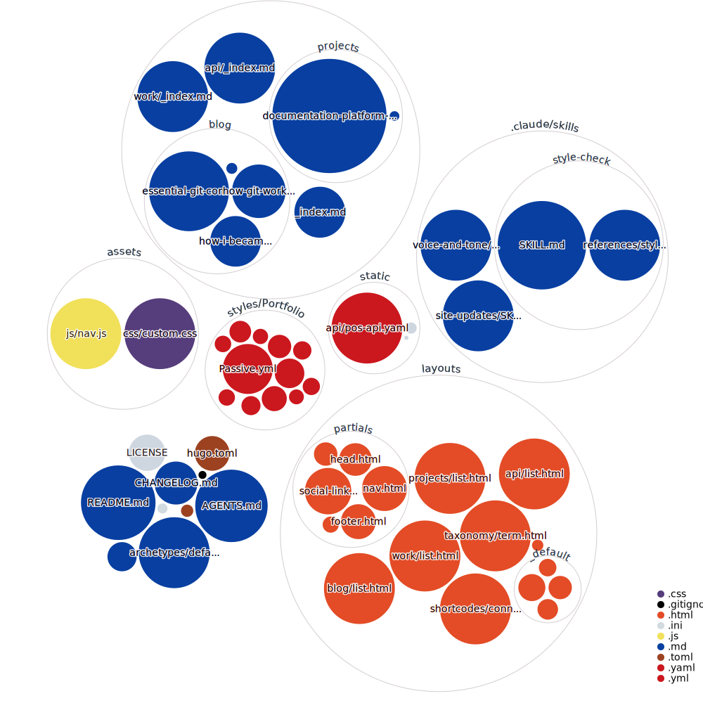

# Rendaniwrites site

Personal portfolio site, built with [Hugo](https://gohugo.io/), deployed on Netlify.

## What this repo actually is

This isn't just a portfolio site. It's a working example of how I run a documentation project properly: I track every change, Vale and the naming checks catch terminology and spelling mistakes automatically, and Claude skills handle the harder calls, like whether something reads consistent with the rest of the site.

## Getting started

```bash
hugo server -D
```

Builds to `public/` (gitignored) with `hugo`.

## Site structure

- **About** (`/`): who I am
- **Resume** (`/work/`): work history
- **Projects** (`/projects/`): case studies
- **Blog** (`/blog/`): posts
- **API sample** (`/api/`): playground

## Repo structure



- `content/`: site pages (about, work, projects, blog) in Markdown
- `layouts/`: Hugo templates and shortcodes
- `archetypes/`: front matter templates for new content
- `static/`: images and other files served as-is
- `assets/`: files Hugo processes (e.g. CSS)
- `styles/`: Vale style rules for prose linting
- `.claude/skills/`: Claude Code skills used while writing and reviewing content

## AI tooling

I switch between Cursor and Claude Code, not both at once, depending on token budget for the day. `AGENTS.md` is the shared instruction file both read: naming conventions, commit format, heading rules, when to ask before restructuring. `CLAUDE.md` imports it directly (`@AGENTS.md`) instead of duplicating the rules, so switching tools mid-project doesn't mean switching conventions.

## Pipeline

This repo runs on short-lived branches. My pipeline mixes deterministic and probabilistic checks, plus a review step.

- Deterministic checks always give the same exact result for the same input.
- Probabilistic checks weigh patterns and risk instead of a fixed rule.
- Every change still goes through a pull request I review and approve before it ships.

### Deterministic

Automated workflows that run on their own, triggered by something happening in the repo, a pull request, an update, or a schedule, not by me running them by hand.

| Workflow | Runs when | What it does |
|---|---|---|
| [vale.yml](.github/workflows/vale.yml) | A pull request changes site content | Checks spelling, terminology, and style |
| [check-image-naming.yml](.github/workflows/check-image-naming.yml) | A pull request adds a new image | Checks the image follows a consistent naming pattern |
| [repo-visualizer.yml](.github/workflows/repo-visualizer.yml) | New changes land on the main branch | Redraws the file-tree picture at the top of this README |
| [auto-update-pr.yml](.github/workflows/auto-update-pr.yml) | New changes land on the main branch | Keeps other open pull requests in sync with the latest changes, so they don't fall behind and conflict |
| [stale-pr-notice.yml](.github/workflows/stale-pr-notice.yml) | Every Monday morning | Flags pull requests that have sat untouched for two weeks or more |

Netlify deploys on every update to the main branch, independently of any workflow above.

### Probabilistic

A skill is a saved set of instructions I've taught Claude to follow for a specific task. Claude can notice on its own that one applies and use it, or I can call it directly by typing its name in the Claude Code terminal, like a shortcut.

| Skill | What it does | Shortcut |
|---|---|---|
| [style-check](.claude/skills/style-check/) | Reviews writing across the whole site for consistency, catching what Vale structurally can't: the same term worded two different ways on different pages, a sentence that repeats something said elsewhere, a section whose structure doesn't match its neighbors | `/style-check` |
| [voice-and-tone](.claude/skills/voice-and-tone/) | Checks a blog draft has one clear point, a solid structure, and a strong ending, the way an editor would | `/voice-and-tone` |
| [site-updates](.claude/skills/site-updates/) | Reads recent commits and writes a plain-English changelog entry, deciding what's actually worth telling a reader about | `/site-updates` |

## Commit conventions

See [AGENTS.md](AGENTS.md) for commit message format, file naming, and content style rules.

## Using this repo

This repo is [MIT licensed](LICENSE).

**You can** fork it, adapt it, and use it as a template for your own portfolio, no attribution required.

If you want to talk about documentation systems, AI tooling, or working together, [get in touch](mailto:rluvhengo2@gmail.com).
