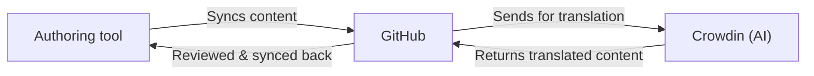

## Background

The company was entering a new international market. That meant three things needed to happen before the launch:

- Prospect customers needed to understand the product in the local language
- The support team needed localized documentation to train on
- The team joining the new regional office needed documentation in their language from day one

All of our product documentation over 9,000 files existed only in English. There was no translation process. No localization tool. No prior experience on my end with any of this.

I was assigned to lead the project. 

---

## The problem

The requirement was clear. Everything else wasn't. Translate all product documentation from English to the target language, automatically, using AI as much as possible, without disrupting the existing docs lifecycle or creating extra manual work for the team.

**What we were aiming for:**

- Embed translation into the existing docs pipeline - not build something separate
- Automate as much as possible, building on what was already there
- Choose tools that supported that automation and our existing pipeline rather than creating new manual work
- Start with product documentation only not because that was the limit, but because building right for one requirement is how you build something that scales

**How I led this, from tool selection to launch:**

I aligned with the PM on vendor relationship and discovery calls, the project roadmap, and quality standards and translation agency alignment.

I was responsible for the content audit and tool evaluation, pipeline design and approval, onboarding teams on Crowdin, building and testing the automation, and making sure the solution fit inside how we already worked.

---

## Discovery

### Choosing a tool that fit our existing docs pipeline

Before looking at any tool or speaking to any vendor, I did a content audit - mapping our existing tooling, formatting types, and docs structure. The goal was to know exactly what to look for when we started exploring vendors, and to make sure whatever tool we chose wouldn't disrupt how technical writers were already working.

I involved engineering from the beginning because they would also be translating their application strings using the same tool. This meant the localization tool had to support both documentation syntax and code syntax - and having engineering in the vendor discovery calls meant we could cover both needs in one conversation.

The PM identified two vendors with strong reputations. We ran discovery calls with both, asking questions based on what we already knew from the content audit.

We chose Crowdin because it supported all our syntaxes - documentation formatting and code. The other tool handled documentation well but didn't cover code syntax cleanly. Since both teams needed to use the same platform, Crowdin was the right fit.

Fit over features. The best tool is the one your team doesn't have to think about.

---

## Exploration

*AI handled the translation. The rules we built around it made it trustworthy.*

### Validating translation quality before building anything

Before designing anything, we needed to answer one question: was AI translation good enough for our documentation?

The PM aligned with the translation agency on what acceptable quality looked like and what to watch out for. My job was to learn the tool and produce the sample.

I onboarded myself on Crowdin - how it works, how to download translations, how it counts strings, what manual steps existed that I could eventually automate. This happened before the pipeline design could begin. You can't design a system around a tool you don't understand yet.

In collaboration with the PM, I selected 5 to 10 documentation files that represented a range of our content types - then sent them to the translation agency to rate the quality of the AI output against the standards the PM had agreed with them.

Their verdict: acceptable, with minor corrections.

**Using AI to translate was the goal. One validation call confirmed it was the right call.**

AI-first translation with a human review layer became possible because we validated the assumption before building anything around it. If the quality hadn't been acceptable, the pipeline design would have been completely different - more human involvement, different tooling, different costs.

The agency's feedback also told us what to watch out for - which later informed the terminology files and translation memory work.

### Adding localization to what already existed

As the platform owner, I understood the existing docs lifecycle better than anyone else on the project. That understanding was what made pipeline design possible.

I created an updated version of the documentation pipeline - adding Crowdin as a layer within the existing flow rather than beside it. The goal was to extend what already existed, not build something new that the team would have to maintain separately.

**The flow I designed:**

A change made in the authoring tool syncs automatically to GitHub. GitHub triggers an upload to Crowdin. Crowdin translates. The download workflow runs every night and creates a pull request with the localized content back in GitHub. I review and merge. The authoring tool syncs the localized content back.

Contributors never have to touch Crowdin. Translation happens in the background.

I presented the pipeline diagram to the infrastructure (infra) team - including the architect responsible for the repo. This wasn't just for sign-off. I needed three things from that meeting: confirmation that adding Crowdin would work within the existing GitHub structure, their buy-in so I'd have their support when things broke, and time for them to plan their sprint around the permissions and credentials a new tool requires.

The infrastructure team approved the pipeline. We aligned on GitHub Actions as the automation layer.

Through research and testing, I confirmed that Crowdin supports sync via CLI and GitHub Actions. Since our documentation was already stored in GitHub, GitHub Actions was the natural fit - the automation could live inside the existing infrastructure without adding a separate integration layer.

---

## Implementation

### Building with engineering, fixing with collaboration

I collaborated closely with an engineer on building the workflows. I provided the required documentation structure - mirroring what already existed in the repo - and we tested together until the action was working correctly.

The PM and I stayed aligned throughout. I kept a Confluence one-pager updated weekly so the PM always had visibility on progress without needing a status call.

During testing, I noticed the AI was translating product names and changing markdown syntax - and when the syntax changed, content didn't render correctly back in the authoring tool. I worked with an AI engineer to fix the prompt - adding clear rules for what the AI can translate, what it can't translate, and that it must never change markdown syntax. Getting the prompt right took exploration. It wasn't a one-time fix.

I also assigned a technical writer to build a product name file - a list of terms the AI must never translate. Before they could do that, I onboarded them on Crowdin. The technical writer then met with the product owner and engineering manager to align on which terms to protect across both documentation and engineering. Once approved, the technical writer uploaded the terminology file to Crowdin.

This cross-functional alignment was necessary before we could add a single protected term. It was a people and process problem before it was a technical one.

### The work that happened while building the pipeline

Docs was the first team on Crowdin. Once the pipeline was running for documentation, I onboarded engineering so they could begin translating their application strings on the same platform.

While I built and tested the pipeline, two other workstreams ran in parallel.

I researched how well-known documentation sites handle multiple languages, looking at what path conventions were standard in the industry. I also asked the authoring tool vendor directly what other clients in similar situations were doing. From that research I proposed two domain options to the PM. The PM chose one.

I also had meetings directly with the authoring tool vendor to work out how to publish English and localized documentation side by side - letting a user view any page in English and switch to the localized version without losing their place.

---

## Challenges

### Timeouts under release pressure

During the initial translation of 9,000 files, the scheduled workflow handled it incrementally over the sprint with no issues. The problem appeared after launch, during release weeks - when the workflow had to process and ship large volumes of changes at the same time.

The download workflow would run, attempt to delete the stale branch from the previous run, and then try to export the translations from Crowdin. With the volume of files during a release, the export timed out before completing. The workflow failed mid-run - it deleted the old branch but only partially created the new one. It either didn't create the pull request or created it incorrectly.

The next scheduled run hit the same problem - the branch already existed under the same name, so the workflow couldn't create a new pull request cleanly.

I raised the issue with the infra engineer and we agreed on a fix: process translations in batches, capping the number of files per run so the export completed without hitting the timeout. The fix was in place within 48 hours.

The trade-off: during large releases, I need to manually retrigger the workflow multiple times until it processes all files.

### A process gap that kept surfacing

The workflow always creates the pull request under the same branch name. If that branch isn't deleted after merging, the next translation run can't create a new pull request correctly.

During busy release cycles, it was easy to forget. This caused repeated failures that required manual intervention to resolve. The underlying issue wasn't technical - nobody had defined branch deletion as part of their workflow. We assumed it. That assumption cost us time repeatedly.

### File path and rendering breaks

Sometimes the translation changed the mapping of files - adding extra strings to the path or removing strings the authoring tool expected. When this happened, the pages wouldn't render.

This showed up in two ways: I caught some breaks during PR review, others only became visible after merging. New pages were the most common trigger - a new English page would have a clean path, but Crowdin would sometimes alter it during translation, breaking the table of contents or navigation.

This happened multiple times and was a recurring issue throughout the project.

### Authoring tool snippets

Reusable content snippets in the authoring tool don't come through as markdown files. Crowdin doesn't pick them up.

We needed to add an AI translation disclaimer to the target language pages - content that doesn't exist in the English version. I added it manually through the authoring tool, but the next sync overwrote it with the English version.

The current workaround is to maintain those snippets manually outside the automated flow. A permanent fix is still in progress.

---

## Key results

- 9,000+ documentation files translated from English to the target language
- Delivered in under two sprints
- Minimum viable product (MVP) scope maintained - product documentation only, as required
- Pipeline built into the existing infrastructure with no change to contributor workflows
- Terminology files and prompt rules protecting product names and syntax across every translation run
- Onboarded engineering on Crowdin, expanding the platform beyond the docs team
- Same pipeline now running for restricted documentation

The translation was never the hard part. Making it disappear into how the team already works was.

---

## What I'd do differently

**Define process ownership before launch, not after**

The branch deletion problem kept surfacing because nobody had defined it as part of their workflow - we assumed it. I'd define ownership of every manual step in the release process before launch, agree on it with the team, and document it. Assumptions in a shared pipeline become everyone's problem.

**Align on terminology ownership as the product grows**

With the product growing fast, I could have aligned with the PM earlier on how to keep product terminology consistent across both the application and the documentation. Engineering and docs were both on Crowdin, but there was no shared ownership of how we'd maintain terminology as the product evolved. That gap only gets harder to close the longer it's left open.

**Think about reusable content in the context of translation from the start**

The team had started using reusable content snippets in the authoring tool. When these synced with Crowdin, they didn't come through as markdown files - so Crowdin wasn't translating them. Instead of discovering this after launch and trying to force a workaround from the authoring tool side, I could have thought earlier about how to manage reusable content in the context of translation. The authoring tool wasn't the source of truth for translated snippets. Forcing content from there created the overwriting problem. Understanding that earlier would have avoided it.

**Agree on a failure protocol with infra before launch**

The timeout issue was difficult to catch before real release scale - that I wouldn't change. But what I'd change is agreeing with infra upfront on what happens when something breaks at scale. Having that protocol in place before the first failure would have reduced the time between problem and fix.

---

## What this project taught me

I came into this project knowing nothing about localization. I had just finished a major platform migration. I was handed a requirement, a roadmap, a PM to align with, and no playbook.

What made it work wasn't expertise. It was being willing to start before I was ready, being comfortable saying I don't know when it mattered, and knowing how to find the answer through the right people.

The project involved engineering, infra, a PM, a technical writer, a translation agency, marketing, and the authoring tool vendor directly - all at different stages, for different reasons. Managing all of that communication, under pressure, while also building the pipeline - that's what I'm most proud of.

Not the 9,000 files. The collaboration that made them possible.
